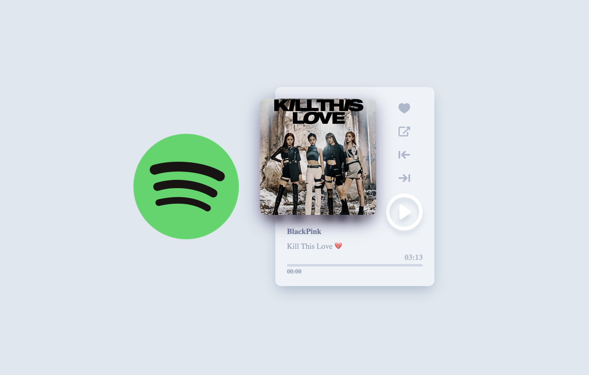

# <a href="https://spotify-clone-js.netlify.app">Spotify-Mini</a>

 
</img>
 
 

<!--  -->

<!--   -->

# Project Description

Spotify Mini is a music player for someone who loves to hear music.
 
The user can play, pause, and change songs.

 

# Technologies Used

 

